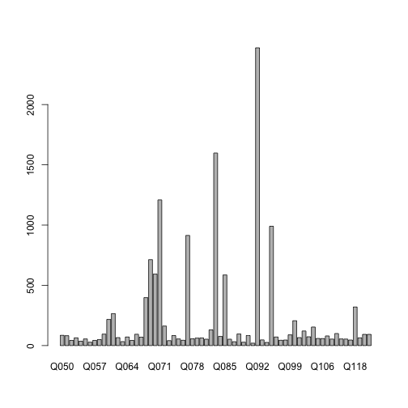
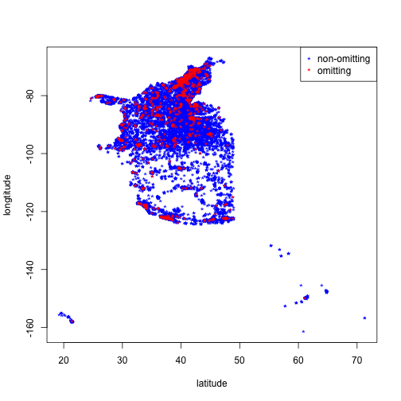
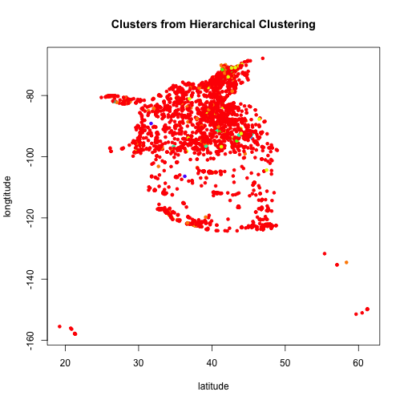
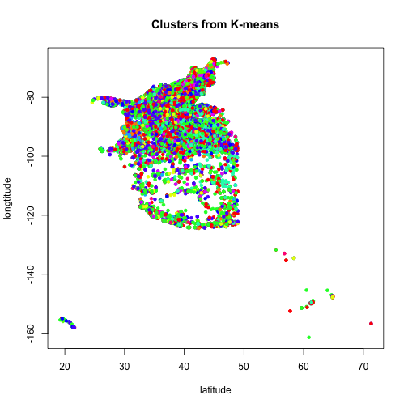
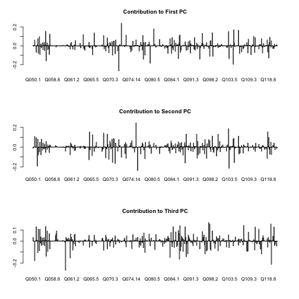
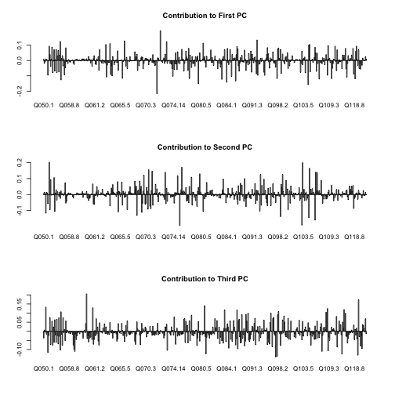

---
output:
  pdf_document:
    keep_tex: yes
    number_sections: yes
    toc: yes
---
% STAT 133 Final Report
% Student: Xi Chen, SID: 22824137


Preliminary Data Analysis
========================================================
First we analyze the if some questions are omitted more than others:

```r
filtered.data = read.table("ling-data-clean.data", header = T)
vars = grep("Q", colnames(filtered.data), value = T)
omitted.count = apply(filtered.data[, vars] == 0, sum, MARGIN = c(2))  # filtered.data is raw data with specified obs removed
barplot(omitted.count)
```

 


It's evident from the bar plot that certain questions are omitted significantly more than others. Next we will analyze what are the outliers and if the exclusion is related to geography:

```r
outliers = names(omitted.count[omitted.count > quantile(omitted.count, probs = c(0.95))])
print(outliers)
```

```
## [1] "Q071" "Q083" "Q092" "Q095"
```

```r
omitters.ind = filtered.data[, outliers] == 0
omitters = filtered.data[omitters.ind, ]
plot(filtered.data[-omitters.ind, "lat"], filtered.data[-omitters.ind, "long"], 
    col = "blue", xlab = "latitude", ylab = "longtitude", pch = "*")
points(omitters[, "lat"], omitters[, "long"], col = "red", pch = "*")
legend("topright", c("non-omitting", "omitting"), pch = c("*"), col = c("blue", 
    "red"))
```

 


We can see from the graph that although there is a slight correlation between omitting these questions and geographic location, the connection is not conclusive.

Relations between questions and geographic location
========================================================
We will first look at the relations between some of the questions and location by inspecting the results of Hierarchical Clustering and K-means Clustering


```r
binary.data = read.table("binary-ling-data.data", header = T)
# since hclust has a running time much worse than kmeans, we use a sampled
# set here to explore
sampled = sample(x = 1:nrow(binary.data), size = 5966)
binary.data.sampled = binary.data[sampled, ]
binary.vars = grep("Q", names(binary.data), value = T)
selected.vars = binary.vars[65:107]  # Q60-64
binary.dist = dist(binary.data.sampled[, selected.vars])
tree = hclust(binary.dist)
hclust.labels = cutree(tree, h = 3)
colors = rainbow(max(hclust.labels))  # brewer.pal(name='Blues',n=max(hclust.labels))
plot(binary.data.sampled[, "lat"], binary.data.sampled[, "long"], col = colors[hclust.labels], 
    xlab = "latitude", ylab = "longtitude", pch = 20, main = "Clusters from Hierarchical Clustering")
```

 

```r

kmeans.labels = kmeans(binary.data[, selected.vars], centers = max(hclust.labels))$cluster
plot(binary.data[, "lat"], binary.data[, "long"], col = colors[kmeans.labels], 
    xlab = "latitude", ylab = "longtitude", pch = 20, main = "Clusters from K-means")
```

 


From both the results of K-means and Hierarchical Clustering, we can see that there are dominant clusters that are distributed relatively uniformly in terms of geographic-location. On the other hand, there exist a certain number of smaller groups that exihbit stronger location association. This phenomenon can be interpreted as certain dialects are prevalent everywhere and hence do not indicate strong association with specific areas. On the other hand, some dialects might be tied more tightly to the locations that use the dialects. 

Then we will investigate if we can use some questions to predict to answers of others. If the answer is yes, then it would be safe to assume that these questions do characterize different dialects. In particular, we will try to use a subset of the binarified data to predict another subset using multinomial logistic classification


```r
train = sample(1:nrow(binary.data), size = 5000)
test = sample(setdiff(1:nrow(binary.data), train), size = 5000)

predicted.vars = vars[1:11]  # Q50-Q60
temp = cbind(filtered.data[train, predicted.vars], binary.data[train, selected.vars])
library("nnet")
Mode <- function(x) {
    ux <- unique(x)
    ux[which.max(tabulate(match(x, ux)))]
}
for (q in predicted.vars) {
    sink(file = "/dev/null")
    multi = multinom(paste(q, " ~ ", paste(selected.vars, collapse = "+")), 
        data = temp, maxit = 500)
    sink()
    predicted = predict(multi, binary.data[test, selected.vars])
    actual = filtered.data[test, q]
    print(paste("Using answers from Q60-64 to classify answer of ", q))
    print("Rate of naive classifier:")
    print(sum(Mode(actual) == actual)/length(test))
    print("Rate of this classifier:")
    print(sum(predicted == actual)/length(test))
}
```

```
## [1] "Using answers from Q60-64 to classify answer of  Q050"
## [1] "Rate of naive classifier:"
## [1] 0.409
## [1] "Rate of this classifier:"
## [1] 0.4186
## [1] "Using answers from Q60-64 to classify answer of  Q051"
## [1] "Rate of naive classifier:"
## [1] 0.677
## [1] "Rate of this classifier:"
## [1] 0.675
## [1] "Using answers from Q60-64 to classify answer of  Q052"
## [1] "Rate of naive classifier:"
## [1] 0.3798
## [1] "Rate of this classifier:"
## [1] 0.401
## [1] "Using answers from Q60-64 to classify answer of  Q053"
## [1] "Rate of naive classifier:"
## [1] 0.876
## [1] "Rate of this classifier:"
## [1] 0.8756
## [1] "Using answers from Q60-64 to classify answer of  Q054"
## [1] "Rate of naive classifier:"
## [1] 0.907
## [1] "Rate of this classifier:"
## [1] 0.9058
## [1] "Using answers from Q60-64 to classify answer of  Q055"
## [1] "Rate of naive classifier:"
## [1] 0.8778
## [1] "Rate of this classifier:"
## [1] 0.877
## [1] "Using answers from Q60-64 to classify answer of  Q056"
## [1] "Rate of naive classifier:"
## [1] 0.6106
## [1] "Rate of this classifier:"
## [1] 0.6222
## [1] "Using answers from Q60-64 to classify answer of  Q057"
## [1] "Rate of naive classifier:"
## [1] 0.6878
## [1] "Rate of this classifier:"
## [1] 0.6876
## [1] "Using answers from Q60-64 to classify answer of  Q058"
## [1] "Rate of naive classifier:"
## [1] 0.5264
## [1] "Rate of this classifier:"
## [1] 0.5448
## [1] "Using answers from Q60-64 to classify answer of  Q059"
## [1] "Rate of naive classifier:"
## [1] 0.5222
## [1] "Rate of this classifier:"
## [1] 0.5208
## [1] "Using answers from Q60-64 to classify answer of  Q060"
## [1] "Rate of naive classifier:"
## [1] 0.6556
## [1] "Rate of this classifier:"
## [1] 1
```


We will use the constant function $f(x) = Mode(X)$ as a baseline naive classifier to compare the multinomial classifier's performance. The fact that these naive classifiers can sometimes outperform naive classifiers suggest a certain level of connection between some of these questions, but it also revelas that there might not be associations between certain pairs of questions.


Dimensionality Reduction
========================================================
Since it's hard to explore high-dimensional data, we will apply the usual dimensionality reduction technique to aid our exploration. Notice here it doesn't make sense to apply PCA to the raw responses data, because the discrete values in each dimension (responses to questions) do not admit proper interpretation in real number domain.


```r
# again, we use a sampled set instead of the whole data set
pca = prcomp(binary.data[, binary.vars])
# look at summary
summary(pca)
```

```
## Importance of components:
##                           PC1    PC2    PC3    PC4    PC5    PC6    PC7
## Standard deviation     1.2191 1.1252 1.0225 0.8773 0.8460 0.8111 0.7855
## Proportion of Variance 0.0411 0.0350 0.0289 0.0213 0.0198 0.0182 0.0171
## Cumulative Proportion  0.0411 0.0762 0.1051 0.1265 0.1463 0.1645 0.1816
##                           PC8    PC9   PC10   PC11   PC12   PC13   PC14
## Standard deviation     0.7570 0.7006 0.6763 0.6650 0.6543 0.6426 0.6325
## Proportion of Variance 0.0159 0.0136 0.0127 0.0122 0.0118 0.0114 0.0111
## Cumulative Proportion  0.1974 0.2110 0.2237 0.2359 0.2478 0.2592 0.2703
##                          PC15   PC16   PC17   PC18    PC19    PC20    PC21
## Standard deviation     0.6227 0.6135 0.6100 0.5979 0.59447 0.58934 0.58103
## Proportion of Variance 0.0107 0.0104 0.0103 0.0099 0.00978 0.00962 0.00935
## Cumulative Proportion  0.2810 0.2915 0.3018 0.3117 0.32144 0.33106 0.34040
##                           PC22    PC23    PC24    PC25   PC26    PC27
## Standard deviation     0.57233 0.56570 0.56459 0.55872 0.5541 0.54994
## Proportion of Variance 0.00907 0.00886 0.00883 0.00864 0.0085 0.00837
## Cumulative Proportion  0.34947 0.35833 0.36716 0.37580 0.3843 0.39268
##                           PC28    PC29    PC30    PC31    PC32    PC33
## Standard deviation     0.54498 0.54068 0.53830 0.53521 0.53129 0.52600
## Proportion of Variance 0.00822 0.00809 0.00802 0.00793 0.00782 0.00766
## Cumulative Proportion  0.40090 0.40899 0.41702 0.42495 0.43276 0.44042
##                           PC34    PC35    PC36    PC37    PC38    PC39
## Standard deviation     0.52327 0.51913 0.51521 0.51473 0.51159 0.50842
## Proportion of Variance 0.00758 0.00746 0.00735 0.00734 0.00725 0.00716
## Cumulative Proportion  0.44800 0.45547 0.46282 0.47015 0.47740 0.48455
##                           PC40    PC41    PC42    PC43    PC44   PC45
## Standard deviation     0.50675 0.50499 0.50156 0.49782 0.49364 0.4919
## Proportion of Variance 0.00711 0.00706 0.00697 0.00686 0.00675 0.0067
## Cumulative Proportion  0.49166 0.49873 0.50569 0.51255 0.51930 0.5260
##                           PC46    PC47    PC48    PC49    PC50   PC51
## Standard deviation     0.48876 0.48639 0.48175 0.47963 0.47674 0.4733
## Proportion of Variance 0.00661 0.00655 0.00643 0.00637 0.00629 0.0062
## Cumulative Proportion  0.53261 0.53916 0.54559 0.55196 0.55825 0.5645
##                           PC52    PC53    PC54    PC55    PC56    PC57
## Standard deviation     0.47228 0.47044 0.46728 0.46681 0.46331 0.46016
## Proportion of Variance 0.00618 0.00613 0.00605 0.00603 0.00594 0.00586
## Cumulative Proportion  0.57063 0.57676 0.58280 0.58883 0.59478 0.60064
##                           PC58    PC59    PC60    PC61    PC62    PC63
## Standard deviation     0.45343 0.45176 0.44834 0.44389 0.44075 0.43897
## Proportion of Variance 0.00569 0.00565 0.00557 0.00546 0.00538 0.00534
## Cumulative Proportion  0.60633 0.61198 0.61755 0.62300 0.62838 0.63372
##                           PC64    PC65    PC66    PC67    PC68    PC69
## Standard deviation     0.43668 0.43304 0.43107 0.42579 0.42411 0.42176
## Proportion of Variance 0.00528 0.00519 0.00514 0.00502 0.00498 0.00492
## Cumulative Proportion  0.63900 0.64419 0.64933 0.65435 0.65933 0.66426
##                           PC70    PC71    PC72    PC73    PC74    PC75
## Standard deviation     0.41993 0.41422 0.41078 0.40661 0.40159 0.39717
## Proportion of Variance 0.00488 0.00475 0.00467 0.00458 0.00447 0.00437
## Cumulative Proportion  0.66914 0.67389 0.67856 0.68314 0.68761 0.69197
##                           PC76    PC77   PC78    PC79    PC80    PC81
## Standard deviation     0.39544 0.39308 0.3897 0.38345 0.38190 0.38146
## Proportion of Variance 0.00433 0.00428 0.0042 0.00407 0.00404 0.00403
## Cumulative Proportion  0.69630 0.70058 0.7048 0.70886 0.71289 0.71692
##                           PC82    PC83    PC84    PC85    PC86    PC87
## Standard deviation     0.37897 0.37591 0.37140 0.36828 0.36514 0.36151
## Proportion of Variance 0.00398 0.00391 0.00382 0.00376 0.00369 0.00362
## Cumulative Proportion  0.72090 0.72481 0.72863 0.73239 0.73608 0.73970
##                           PC88    PC89    PC90    PC91    PC92    PC93
## Standard deviation     0.35939 0.35694 0.35225 0.35107 0.34989 0.34728
## Proportion of Variance 0.00358 0.00353 0.00344 0.00341 0.00339 0.00334
## Cumulative Proportion  0.74327 0.74680 0.75024 0.75365 0.75704 0.76038
##                           PC94    PC95    PC96    PC97   PC98    PC99
## Standard deviation     0.34172 0.33965 0.33889 0.33580 0.3348 0.33321
## Proportion of Variance 0.00323 0.00319 0.00318 0.00312 0.0031 0.00307
## Cumulative Proportion  0.76361 0.76680 0.76998 0.77311 0.7762 0.77928
##                          PC100 PC101   PC102   PC103  PC104   PC105
## Standard deviation     0.33100 0.329 0.32712 0.32616 0.3239 0.32134
## Proportion of Variance 0.00303 0.003 0.00296 0.00295 0.0029 0.00286
## Cumulative Proportion  0.78232 0.785 0.78828 0.79122 0.7941 0.79699
##                          PC106   PC107   PC108   PC109   PC110   PC111
## Standard deviation     0.32078 0.31855 0.31645 0.31353 0.31185 0.30771
## Proportion of Variance 0.00285 0.00281 0.00277 0.00272 0.00269 0.00262
## Cumulative Proportion  0.79984 0.80265 0.80542 0.80814 0.81083 0.81345
##                          PC112   PC113   PC114  PC115   PC116   PC117
## Standard deviation     0.30707 0.30477 0.30253 0.3005 0.29875 0.29763
## Proportion of Variance 0.00261 0.00257 0.00253 0.0025 0.00247 0.00245
## Cumulative Proportion  0.81607 0.81864 0.82117 0.8237 0.82614 0.82859
##                          PC118   PC119   PC120   PC121  PC122   PC123
## Standard deviation     0.29613 0.29405 0.29193 0.29041 0.2883 0.28648
## Proportion of Variance 0.00243 0.00239 0.00236 0.00234 0.0023 0.00227
## Cumulative Proportion  0.83102 0.83342 0.83578 0.83811 0.8404 0.84268
##                          PC124   PC125   PC126   PC127  PC128  PC129
## Standard deviation     0.28477 0.28135 0.27826 0.27658 0.2755 0.2751
## Proportion of Variance 0.00225 0.00219 0.00214 0.00212 0.0021 0.0021
## Cumulative Proportion  0.84493 0.84712 0.84927 0.85138 0.8535 0.8556
##                          PC130   PC131   PC132   PC133   PC134   PC135
## Standard deviation     0.27251 0.26941 0.26795 0.26582 0.26498 0.26081
## Proportion of Variance 0.00206 0.00201 0.00199 0.00196 0.00194 0.00188
## Cumulative Proportion  0.85764 0.85965 0.86163 0.86359 0.86553 0.86742
##                          PC136   PC137   PC138   PC139   PC140   PC141
## Standard deviation     0.25959 0.25845 0.25805 0.25621 0.25573 0.25407
## Proportion of Variance 0.00187 0.00185 0.00184 0.00182 0.00181 0.00179
## Cumulative Proportion  0.86928 0.87113 0.87298 0.87479 0.87660 0.87839
##                          PC142   PC143   PC144   PC145   PC146   PC147
## Standard deviation     0.24956 0.24902 0.24683 0.24256 0.24197 0.24082
## Proportion of Variance 0.00172 0.00172 0.00169 0.00163 0.00162 0.00161
## Cumulative Proportion  0.88012 0.88183 0.88352 0.88515 0.88677 0.88837
##                          PC148   PC149   PC150  PC151   PC152   PC153
## Standard deviation     0.23950 0.23820 0.23492 0.2326 0.23151 0.23018
## Proportion of Variance 0.00159 0.00157 0.00153 0.0015 0.00148 0.00147
## Cumulative Proportion  0.88996 0.89153 0.89306 0.8946 0.89604 0.89751
##                          PC154   PC155   PC156   PC157   PC158   PC159
## Standard deviation     0.23002 0.22771 0.22616 0.22541 0.22413 0.22317
## Proportion of Variance 0.00146 0.00144 0.00142 0.00141 0.00139 0.00138
## Cumulative Proportion  0.89898 0.90041 0.90183 0.90323 0.90463 0.90600
##                          PC160   PC161   PC162   PC163   PC164   PC165
## Standard deviation     0.22185 0.21913 0.21744 0.21621 0.21435 0.21337
## Proportion of Variance 0.00136 0.00133 0.00131 0.00129 0.00127 0.00126
## Cumulative Proportion  0.90737 0.90870 0.91001 0.91130 0.91257 0.91383
##                          PC166   PC167   PC168   PC169   PC170   PC171
## Standard deviation     0.21221 0.21100 0.20984 0.20972 0.20743 0.20667
## Proportion of Variance 0.00125 0.00123 0.00122 0.00122 0.00119 0.00118
## Cumulative Proportion  0.91508 0.91631 0.91753 0.91875 0.91994 0.92112
##                          PC172   PC173   PC174   PC175   PC176   PC177
## Standard deviation     0.20527 0.20397 0.20279 0.20182 0.20109 0.19827
## Proportion of Variance 0.00117 0.00115 0.00114 0.00113 0.00112 0.00109
## Cumulative Proportion  0.92229 0.92344 0.92458 0.92571 0.92683 0.92792
##                          PC178   PC179   PC180   PC181   PC182   PC183
## Standard deviation     0.19631 0.19530 0.19426 0.19336 0.19215 0.19157
## Proportion of Variance 0.00107 0.00106 0.00104 0.00104 0.00102 0.00102
## Cumulative Proportion  0.92898 0.93004 0.93108 0.93212 0.93314 0.93416
##                          PC184 PC185   PC186   PC187   PC188   PC189
## Standard deviation     0.19086 0.190 0.18902 0.18842 0.18749 0.18592
## Proportion of Variance 0.00101 0.001 0.00099 0.00098 0.00097 0.00096
## Cumulative Proportion  0.93517 0.936 0.93715 0.93814 0.93911 0.94007
##                          PC190   PC191   PC192   PC193   PC194   PC195
## Standard deviation     0.18406 0.18358 0.18261 0.18206 0.17951 0.17911
## Proportion of Variance 0.00094 0.00093 0.00092 0.00092 0.00089 0.00089
## Cumulative Proportion  0.94100 0.94194 0.94286 0.94378 0.94467 0.94556
##                          PC196   PC197   PC198   PC199   PC200   PC201
## Standard deviation     0.17789 0.17538 0.17440 0.17346 0.17281 0.17195
## Proportion of Variance 0.00088 0.00085 0.00084 0.00083 0.00083 0.00082
## Cumulative Proportion  0.94644 0.94729 0.94813 0.94896 0.94979 0.95061
##                         PC202   PC203   PC204   PC205   PC206   PC207
## Standard deviation     0.1700 0.16941 0.16888 0.16806 0.16755 0.16693
## Proportion of Variance 0.0008 0.00079 0.00079 0.00078 0.00078 0.00077
## Cumulative Proportion  0.9514 0.95220 0.95299 0.95377 0.95455 0.95532
##                          PC208   PC209   PC210   PC211   PC212   PC213
## Standard deviation     0.16620 0.16590 0.16519 0.16432 0.16320 0.16236
## Proportion of Variance 0.00076 0.00076 0.00076 0.00075 0.00074 0.00073
## Cumulative Proportion  0.95609 0.95685 0.95760 0.95835 0.95909 0.95982
##                          PC214   PC215   PC216   PC217   PC218   PC219
## Standard deviation     0.16165 0.16045 0.15983 0.15792 0.15752 0.15645
## Proportion of Variance 0.00072 0.00071 0.00071 0.00069 0.00069 0.00068
## Cumulative Proportion  0.96054 0.96126 0.96196 0.96265 0.96334 0.96402
##                          PC220   PC221   PC222   PC223   PC224   PC225
## Standard deviation     0.15613 0.15471 0.15421 0.15298 0.15044 0.14881
## Proportion of Variance 0.00067 0.00066 0.00066 0.00065 0.00063 0.00061
## Cumulative Proportion  0.96469 0.96536 0.96601 0.96666 0.96729 0.96790
##                         PC226  PC227  PC228   PC229   PC230   PC231
## Standard deviation     0.1477 0.1468 0.1466 0.14348 0.14290 0.14187
## Proportion of Variance 0.0006 0.0006 0.0006 0.00057 0.00057 0.00056
## Cumulative Proportion  0.9685 0.9691 0.9697 0.97027 0.97083 0.97139
##                          PC232   PC233   PC234   PC235   PC236   PC237
## Standard deviation     0.14146 0.13993 0.13924 0.13805 0.13600 0.13511
## Proportion of Variance 0.00055 0.00054 0.00054 0.00053 0.00051 0.00051
## Cumulative Proportion  0.97194 0.97249 0.97302 0.97355 0.97406 0.97457
##                         PC238  PC239   PC240   PC241   PC242   PC243
## Standard deviation     0.1350 0.1342 0.13066 0.13033 0.12913 0.12779
## Proportion of Variance 0.0005 0.0005 0.00047 0.00047 0.00046 0.00045
## Cumulative Proportion  0.9751 0.9756 0.97604 0.97651 0.97698 0.97743
##                          PC244   PC245   PC246   PC247   PC248   PC249
## Standard deviation     0.12761 0.12704 0.12585 0.12531 0.12392 0.12325
## Proportion of Variance 0.00045 0.00045 0.00044 0.00043 0.00043 0.00042
## Cumulative Proportion  0.97788 0.97833 0.97876 0.97920 0.97962 0.98005
##                          PC250   PC251   PC252   PC253   PC254   PC255
## Standard deviation     0.12285 0.12206 0.12137 0.11936 0.11880 0.11814
## Proportion of Variance 0.00042 0.00041 0.00041 0.00039 0.00039 0.00039
## Cumulative Proportion  0.98046 0.98088 0.98128 0.98168 0.98207 0.98246
##                          PC256   PC257   PC258   PC259   PC260   PC261
## Standard deviation     0.11679 0.11602 0.11595 0.11372 0.11282 0.11071
## Proportion of Variance 0.00038 0.00037 0.00037 0.00036 0.00035 0.00034
## Cumulative Proportion  0.98283 0.98321 0.98358 0.98394 0.98429 0.98463
##                          PC262   PC263   PC264   PC265  PC266  PC267
## Standard deviation     0.10806 0.10717 0.10700 0.10612 0.1049 0.1042
## Proportion of Variance 0.00032 0.00032 0.00032 0.00031 0.0003 0.0003
## Cumulative Proportion  0.98495 0.98527 0.98559 0.98590 0.9862 0.9865
##                         PC268   PC269   PC270   PC271   PC272   PC273
## Standard deviation     0.1038 0.10237 0.10168 0.10133 0.10030 0.09866
## Proportion of Variance 0.0003 0.00029 0.00029 0.00028 0.00028 0.00027
## Cumulative Proportion  0.9868 0.98709 0.98738 0.98766 0.98794 0.98821
##                          PC274   PC275   PC276   PC277   PC278   PC279
## Standard deviation     0.09833 0.09783 0.09670 0.09599 0.09438 0.09357
## Proportion of Variance 0.00027 0.00026 0.00026 0.00026 0.00025 0.00024
## Cumulative Proportion  0.98848 0.98874 0.98900 0.98926 0.98950 0.98975
##                          PC280   PC281   PC282   PC283   PC284   PC285
## Standard deviation     0.09319 0.09144 0.09100 0.09057 0.08904 0.08778
## Proportion of Variance 0.00024 0.00023 0.00023 0.00023 0.00022 0.00021
## Cumulative Proportion  0.98999 0.99022 0.99045 0.99067 0.99089 0.99111
##                          PC286  PC287  PC288  PC289  PC290   PC291   PC292
## Standard deviation     0.08638 0.0860 0.0854 0.0852 0.0842 0.08230 0.08125
## Proportion of Variance 0.00021 0.0002 0.0002 0.0002 0.0002 0.00019 0.00018
## Cumulative Proportion  0.99131 0.9915 0.9917 0.9919 0.9921 0.99231 0.99249
##                          PC293   PC294   PC295   PC296   PC297   PC298
## Standard deviation     0.08030 0.07942 0.07789 0.07748 0.07720 0.07652
## Proportion of Variance 0.00018 0.00017 0.00017 0.00017 0.00017 0.00016
## Cumulative Proportion  0.99267 0.99284 0.99301 0.99318 0.99334 0.99350
##                          PC299   PC300   PC301   PC302   PC303   PC304
## Standard deviation     0.07603 0.07443 0.07355 0.07253 0.07088 0.07066
## Proportion of Variance 0.00016 0.00015 0.00015 0.00015 0.00014 0.00014
## Cumulative Proportion  0.99366 0.99382 0.99397 0.99411 0.99425 0.99439
##                          PC305   PC306   PC307   PC308   PC309   PC310
## Standard deviation     0.07043 0.06899 0.06793 0.06736 0.06640 0.06598
## Proportion of Variance 0.00014 0.00013 0.00013 0.00013 0.00012 0.00012
## Cumulative Proportion  0.99453 0.99466 0.99479 0.99491 0.99503 0.99515
##                          PC311   PC312   PC313   PC314   PC315  PC316
## Standard deviation     0.06518 0.06440 0.06335 0.06267 0.06171 0.0615
## Proportion of Variance 0.00012 0.00011 0.00011 0.00011 0.00011 0.0001
## Cumulative Proportion  0.99527 0.99539 0.99550 0.99561 0.99571 0.9958
##                         PC317  PC318  PC319   PC320   PC321   PC322
## Standard deviation     0.0607 0.0602 0.0592 0.05821 0.05746 0.05680
## Proportion of Variance 0.0001 0.0001 0.0001 0.00009 0.00009 0.00009
## Cumulative Proportion  0.9959 0.9960 0.9961 0.99621 0.99630 0.99639
##                          PC323   PC324   PC325   PC326   PC327   PC328
## Standard deviation     0.05624 0.05613 0.05546 0.05518 0.05490 0.05413
## Proportion of Variance 0.00009 0.00009 0.00009 0.00008 0.00008 0.00008
## Cumulative Proportion  0.99648 0.99656 0.99665 0.99673 0.99682 0.99690
##                          PC329   PC330   PC331   PC332   PC333   PC334
## Standard deviation     0.05400 0.05341 0.05297 0.05259 0.05174 0.05144
## Proportion of Variance 0.00008 0.00008 0.00008 0.00008 0.00007 0.00007
## Cumulative Proportion  0.99698 0.99706 0.99714 0.99721 0.99729 0.99736
##                          PC335   PC336   PC337   PC338   PC339   PC340
## Standard deviation     0.05130 0.05004 0.04941 0.04877 0.04836 0.04773
## Proportion of Variance 0.00007 0.00007 0.00007 0.00007 0.00006 0.00006
## Cumulative Proportion  0.99743 0.99750 0.99757 0.99764 0.99770 0.99776
##                          PC341   PC342   PC343   PC344   PC345   PC346
## Standard deviation     0.04744 0.04692 0.04605 0.04562 0.04414 0.04372
## Proportion of Variance 0.00006 0.00006 0.00006 0.00006 0.00005 0.00005
## Cumulative Proportion  0.99783 0.99789 0.99795 0.99800 0.99806 0.99811
##                          PC347   PC348   PC349   PC350   PC351   PC352
## Standard deviation     0.04304 0.04216 0.04175 0.04166 0.04101 0.04072
## Proportion of Variance 0.00005 0.00005 0.00005 0.00005 0.00005 0.00005
## Cumulative Proportion  0.99816 0.99821 0.99826 0.99831 0.99835 0.99840
##                          PC353   PC354   PC355   PC356   PC357   PC358
## Standard deviation     0.04008 0.03978 0.03976 0.03938 0.03863 0.03859
## Proportion of Variance 0.00004 0.00004 0.00004 0.00004 0.00004 0.00004
## Cumulative Proportion  0.99844 0.99849 0.99853 0.99857 0.99862 0.99866
##                          PC359   PC360   PC361   PC362   PC363   PC364
## Standard deviation     0.03826 0.03745 0.03717 0.03686 0.03656 0.03628
## Proportion of Variance 0.00004 0.00004 0.00004 0.00004 0.00004 0.00004
## Cumulative Proportion  0.99870 0.99874 0.99877 0.99881 0.99885 0.99889
##                          PC365   PC366   PC367   PC368   PC369   PC370
## Standard deviation     0.03602 0.03571 0.03377 0.03327 0.03271 0.03231
## Proportion of Variance 0.00004 0.00004 0.00003 0.00003 0.00003 0.00003
## Cumulative Proportion  0.99892 0.99896 0.99899 0.99902 0.99905 0.99908
##                          PC371   PC372   PC373   PC374   PC375   PC376
## Standard deviation     0.03206 0.03142 0.03101 0.03029 0.02970 0.02958
## Proportion of Variance 0.00003 0.00003 0.00003 0.00003 0.00002 0.00002
## Cumulative Proportion  0.99911 0.99913 0.99916 0.99919 0.99921 0.99923
##                          PC377   PC378   PC379   PC380   PC381   PC382
## Standard deviation     0.02896 0.02860 0.02843 0.02791 0.02787 0.02756
## Proportion of Variance 0.00002 0.00002 0.00002 0.00002 0.00002 0.00002
## Cumulative Proportion  0.99926 0.99928 0.99930 0.99932 0.99935 0.99937
##                          PC383   PC384   PC385   PC386   PC387   PC388
## Standard deviation     0.02707 0.02588 0.02480 0.02449 0.02398 0.02337
## Proportion of Variance 0.00002 0.00002 0.00002 0.00002 0.00002 0.00002
## Cumulative Proportion  0.99939 0.99941 0.99942 0.99944 0.99945 0.99947
##                          PC389   PC390   PC391   PC392   PC393   PC394
## Standard deviation     0.02288 0.02276 0.02255 0.02243 0.02233 0.02186
## Proportion of Variance 0.00001 0.00001 0.00001 0.00001 0.00001 0.00001
## Cumulative Proportion  0.99948 0.99950 0.99951 0.99953 0.99954 0.99955
##                          PC395   PC396   PC397   PC398   PC399   PC400
## Standard deviation     0.02160 0.02138 0.02122 0.02098 0.02053 0.02014
## Proportion of Variance 0.00001 0.00001 0.00001 0.00001 0.00001 0.00001
## Cumulative Proportion  0.99957 0.99958 0.99959 0.99960 0.99962 0.99963
##                          PC401   PC402   PC403   PC404   PC405   PC406
## Standard deviation     0.01989 0.01953 0.01939 0.01878 0.01872 0.01851
## Proportion of Variance 0.00001 0.00001 0.00001 0.00001 0.00001 0.00001
## Cumulative Proportion  0.99964 0.99965 0.99966 0.99967 0.99968 0.99969
##                          PC407   PC408   PC409   PC410   PC411   PC412
## Standard deviation     0.01822 0.01783 0.01764 0.01742 0.01730 0.01715
## Proportion of Variance 0.00001 0.00001 0.00001 0.00001 0.00001 0.00001
## Cumulative Proportion  0.99970 0.99971 0.99971 0.99972 0.99973 0.99974
##                          PC413   PC414   PC415   PC416   PC417   PC418
## Standard deviation     0.01705 0.01696 0.01671 0.01659 0.01646 0.01622
## Proportion of Variance 0.00001 0.00001 0.00001 0.00001 0.00001 0.00001
## Cumulative Proportion  0.99975 0.99976 0.99976 0.99977 0.99978 0.99979
##                          PC419   PC420   PC421   PC422   PC423   PC424
## Standard deviation     0.01596 0.01580 0.01571 0.01552 0.01539 0.01533
## Proportion of Variance 0.00001 0.00001 0.00001 0.00001 0.00001 0.00001
## Cumulative Proportion  0.99979 0.99980 0.99981 0.99981 0.99982 0.99983
##                          PC425   PC426   PC427   PC428   PC429   PC430
## Standard deviation     0.01516 0.01498 0.01486 0.01476 0.01467 0.01449
## Proportion of Variance 0.00001 0.00001 0.00001 0.00001 0.00001 0.00001
## Cumulative Proportion  0.99983 0.99984 0.99984 0.99985 0.99986 0.99986
##                          PC431   PC432   PC433   PC434   PC435  PC436
## Standard deviation     0.01442 0.01400 0.01392 0.01361 0.01352 0.0134
## Proportion of Variance 0.00001 0.00001 0.00001 0.00001 0.00001 0.0000
## Cumulative Proportion  0.99987 0.99987 0.99988 0.99988 0.99989 0.9999
##                         PC437  PC438  PC439  PC440  PC441  PC442  PC443
## Standard deviation     0.0132 0.0129 0.0128 0.0127 0.0126 0.0125 0.0123
## Proportion of Variance 0.0000 0.0000 0.0000 0.0000 0.0000 0.0000 0.0000
## Cumulative Proportion  0.9999 0.9999 0.9999 0.9999 0.9999 0.9999 0.9999
##                         PC444  PC445  PC446  PC447  PC448  PC449  PC450
## Standard deviation     0.0122 0.0121 0.0119 0.0118 0.0118 0.0115 0.0114
## Proportion of Variance 0.0000 0.0000 0.0000 0.0000 0.0000 0.0000 0.0000
## Cumulative Proportion  0.9999 0.9999 0.9999 0.9999 1.0000 1.0000 1.0000
##                         PC451  PC452 PC453  PC454  PC455  PC456  PC457
## Standard deviation     0.0113 0.0111 0.011 0.0107 0.0107 0.0106 0.0104
## Proportion of Variance 0.0000 0.0000 0.000 0.0000 0.0000 0.0000 0.0000
## Cumulative Proportion  1.0000 1.0000 1.000 1.0000 1.0000 1.0000 1.0000
##                        PC458   PC459  PC460   PC461   PC462   PC463
## Standard deviation      0.01 0.00997 0.0097 0.00959 0.00919 0.00915
## Proportion of Variance  0.00 0.00000 0.0000 0.00000 0.00000 0.00000
## Cumulative Proportion   1.00 0.99998 1.0000 0.99999 0.99999 0.99999
##                          PC464   PC465  PC466   PC467   PC468
## Standard deviation     0.00886 0.00873 0.0083 0.00813 0.00763
## Proportion of Variance 0.00000 0.00000 0.0000 0.00000 0.00000
## Cumulative Proportion  0.99999 0.99999 1.0000 1.00000 1.00000
```

```r
trans = solve(pca$rotation)
par(mfrow = c(3, 1))
barplot(trans["PC1", ], main = "Contribution to First PC")
barplot(trans["PC2", ], main = "Contribution to Second PC")
barplot(trans["PC3", ], main = "Contribution to Third PC")
```

 

```r

pca.scaled = prcomp(binary.data[, binary.vars], scale. = T)
# look at summary
summary(pca.scaled)
```

```
## Importance of components:
##                           PC1    PC2    PC3    PC4    PC5    PC6     PC7
## Standard deviation     3.0254 2.7574 2.5768 2.3815 2.2235 2.1634 2.08508
## Proportion of Variance 0.0196 0.0163 0.0142 0.0121 0.0106 0.0100 0.00929
## Cumulative Proportion  0.0196 0.0358 0.0500 0.0621 0.0727 0.0827 0.09197
##                            PC8     PC9    PC10    PC11    PC12    PC13
## Standard deviation     1.97604 1.92798 1.85704 1.80418 1.76443 1.73381
## Proportion of Variance 0.00834 0.00794 0.00737 0.00696 0.00665 0.00642
## Cumulative Proportion  0.10031 0.10825 0.11562 0.12258 0.12923 0.13565
##                           PC14   PC15    PC16    PC17    PC18    PC19
## Standard deviation     1.69945 1.6339 1.62430 1.60918 1.59142 1.57807
## Proportion of Variance 0.00617 0.0057 0.00564 0.00553 0.00541 0.00532
## Cumulative Proportion  0.14182 0.1475 0.15316 0.15870 0.16411 0.16943
##                          PC20    PC21    PC22    PC23    PC24    PC25
## Standard deviation     1.5453 1.51543 1.49202 1.47829 1.45934 1.44399
## Proportion of Variance 0.0051 0.00491 0.00476 0.00467 0.00455 0.00446
## Cumulative Proportion  0.1745 0.17944 0.18420 0.18887 0.19342 0.19787
##                           PC26    PC27    PC28    PC29    PC30    PC31
## Standard deviation     1.43156 1.42273 1.41500 1.40672 1.39600 1.37306
## Proportion of Variance 0.00438 0.00433 0.00428 0.00423 0.00416 0.00403
## Cumulative Proportion  0.20225 0.20658 0.21085 0.21508 0.21925 0.22328
##                         PC32    PC33   PC34    PC35    PC36    PC37
## Standard deviation     1.368 1.36401 1.3507 1.34446 1.33900 1.32313
## Proportion of Variance 0.004 0.00398 0.0039 0.00386 0.00383 0.00374
## Cumulative Proportion  0.227 0.23125 0.2351 0.23901 0.24284 0.24658
##                           PC38    PC39    PC40    PC41    PC42    PC43
## Standard deviation     1.31744 1.31020 1.30792 1.30072 1.29350 1.29005
## Proportion of Variance 0.00371 0.00367 0.00366 0.00362 0.00358 0.00356
## Cumulative Proportion  0.25029 0.25396 0.25761 0.26123 0.26481 0.26836
##                           PC44    PC45    PC46    PC47    PC48    PC49
## Standard deviation     1.28519 1.28255 1.27165 1.26541 1.25711 1.25630
## Proportion of Variance 0.00353 0.00351 0.00346 0.00342 0.00338 0.00337
## Cumulative Proportion  0.27189 0.27541 0.27886 0.28228 0.28566 0.28903
##                           PC50    PC51    PC52    PC53    PC54    PC55
## Standard deviation     1.24878 1.24600 1.24086 1.23697 1.23353 1.22974
## Proportion of Variance 0.00333 0.00332 0.00329 0.00327 0.00325 0.00323
## Cumulative Proportion  0.29236 0.29568 0.29897 0.30224 0.30549 0.30872
##                           PC56    PC57    PC58    PC59    PC60    PC61
## Standard deviation     1.22547 1.21956 1.21933 1.21779 1.21456 1.20642
## Proportion of Variance 0.00321 0.00318 0.00318 0.00317 0.00315 0.00311
## Cumulative Proportion  0.31193 0.31511 0.31829 0.32146 0.32461 0.32772
##                           PC62    PC63    PC64    PC65    PC66  PC67
## Standard deviation     1.20301 1.20107 1.19797 1.19636 1.19280 1.185
## Proportion of Variance 0.00309 0.00308 0.00307 0.00306 0.00304 0.003
## Cumulative Proportion  0.33081 0.33389 0.33696 0.34002 0.34306 0.346
##                           PC68    PC69    PC70    PC71    PC72    PC73
## Standard deviation     1.18290 1.17623 1.17378 1.16943 1.16848 1.16160
## Proportion of Variance 0.00299 0.00296 0.00294 0.00292 0.00292 0.00288
## Cumulative Proportion  0.34905 0.35200 0.35495 0.35787 0.36078 0.36367
##                           PC74    PC75    PC76    PC77    PC78    PC79
## Standard deviation     1.16043 1.15848 1.15638 1.15583 1.15161 1.15022
## Proportion of Variance 0.00288 0.00287 0.00286 0.00285 0.00283 0.00283
## Cumulative Proportion  0.36655 0.36941 0.37227 0.37512 0.37796 0.38079
##                           PC80    PC81    PC82    PC83    PC84    PC85
## Standard deviation     1.14739 1.14271 1.14006 1.13925 1.13537 1.13330
## Proportion of Variance 0.00281 0.00279 0.00278 0.00277 0.00275 0.00274
## Cumulative Proportion  0.38360 0.38639 0.38917 0.39194 0.39469 0.39744
##                           PC86    PC87    PC88    PC89    PC90    PC91
## Standard deviation     1.13255 1.13014 1.12907 1.12763 1.12136 1.11918
## Proportion of Variance 0.00274 0.00273 0.00272 0.00272 0.00269 0.00268
## Cumulative Proportion  0.40018 0.40291 0.40563 0.40835 0.41104 0.41371
##                           PC92    PC93    PC94    PC95    PC96    PC97
## Standard deviation     1.11769 1.11655 1.11408 1.11278 1.11118 1.10807
## Proportion of Variance 0.00267 0.00266 0.00265 0.00265 0.00264 0.00262
## Cumulative Proportion  0.41638 0.41905 0.42170 0.42434 0.42698 0.42961
##                           PC98    PC99  PC100  PC101   PC102   PC103
## Standard deviation     1.10712 1.10474 1.1028 1.1022 1.09881 1.09740
## Proportion of Variance 0.00262 0.00261 0.0026 0.0026 0.00258 0.00257
## Cumulative Proportion  0.43222 0.43483 0.4374 0.4400 0.44261 0.44518
##                          PC104   PC105   PC106   PC107   PC108   PC109
## Standard deviation     1.09629 1.09440 1.09362 1.09136 1.08895 1.08740
## Proportion of Variance 0.00257 0.00256 0.00256 0.00255 0.00253 0.00253
## Cumulative Proportion  0.44775 0.45031 0.45286 0.45541 0.45794 0.46047
##                          PC110   PC111  PC112  PC113   PC114   PC115
## Standard deviation     1.08586 1.08353 1.0827 1.0809 1.07794 1.07577
## Proportion of Variance 0.00252 0.00251 0.0025 0.0025 0.00248 0.00247
## Cumulative Proportion  0.46299 0.46550 0.4680 0.4705 0.47298 0.47545
##                          PC116   PC117   PC118   PC119   PC120   PC121
## Standard deviation     1.07497 1.07404 1.07255 1.07179 1.07170 1.06879
## Proportion of Variance 0.00247 0.00246 0.00246 0.00245 0.00245 0.00244
## Cumulative Proportion  0.47792 0.48039 0.48284 0.48530 0.48775 0.49019
##                          PC122   PC123   PC124   PC125   PC126  PC127
## Standard deviation     1.06847 1.06586 1.06531 1.06329 1.06135 1.0603
## Proportion of Variance 0.00244 0.00243 0.00242 0.00242 0.00241 0.0024
## Cumulative Proportion  0.49263 0.49506 0.49749 0.49990 0.50231 0.5047
##                         PC128   PC129   PC130   PC131   PC132   PC133
## Standard deviation     1.0587 1.05819 1.05633 1.05459 1.05407 1.05319
## Proportion of Variance 0.0024 0.00239 0.00238 0.00238 0.00237 0.00237
## Cumulative Proportion  0.5071 0.50950 0.51188 0.51426 0.51663 0.51900
##                          PC134   PC135   PC136   PC137   PC138   PC139
## Standard deviation     1.05088 1.04990 1.04782 1.04709 1.04512 1.04452
## Proportion of Variance 0.00236 0.00236 0.00235 0.00234 0.00233 0.00233
## Cumulative Proportion  0.52136 0.52372 0.52606 0.52841 0.53074 0.53307
##                          PC140   PC141   PC142   PC143   PC144   PC145
## Standard deviation     1.04364 1.04245 1.04237 1.04102 1.03992 1.03905
## Proportion of Variance 0.00233 0.00232 0.00232 0.00232 0.00231 0.00231
## Cumulative Proportion  0.53540 0.53772 0.54004 0.54236 0.54467 0.54698
##                         PC146  PC147   PC148   PC149   PC150   PC151
## Standard deviation     1.0378 1.0365 1.03526 1.03413 1.03398 1.03068
## Proportion of Variance 0.0023 0.0023 0.00229 0.00229 0.00228 0.00227
## Cumulative Proportion  0.5493 0.5516 0.55386 0.55615 0.55843 0.56070
##                          PC152   PC153   PC154   PC155   PC156   PC157
## Standard deviation     1.02967 1.02866 1.02747 1.02729 1.02571 1.02399
## Proportion of Variance 0.00227 0.00226 0.00226 0.00225 0.00225 0.00224
## Cumulative Proportion  0.56297 0.56523 0.56749 0.56974 0.57199 0.57423
##                          PC158   PC159   PC160   PC161   PC162   PC163
## Standard deviation     1.02378 1.02297 1.02076 1.02007 1.01986 1.01830
## Proportion of Variance 0.00224 0.00224 0.00223 0.00222 0.00222 0.00222
## Cumulative Proportion  0.57647 0.57870 0.58093 0.58315 0.58538 0.58759
##                          PC164   PC165  PC166  PC167  PC168   PC169
## Standard deviation     1.01808 1.01691 1.0156 1.0153 1.0141 1.01304
## Proportion of Variance 0.00221 0.00221 0.0022 0.0022 0.0022 0.00219
## Cumulative Proportion  0.58981 0.59202 0.5942 0.5964 0.5986 0.60081
##                          PC170   PC171   PC172   PC173   PC174   PC175
## Standard deviation     1.01151 1.01125 1.01058 1.01002 1.00953 1.00768
## Proportion of Variance 0.00219 0.00219 0.00218 0.00218 0.00218 0.00217
## Cumulative Proportion  0.60300 0.60519 0.60737 0.60955 0.61172 0.61389
##                          PC176   PC177   PC178   PC179   PC180   PC181
## Standard deviation     1.00636 1.00558 1.00498 1.00471 1.00324 1.00241
## Proportion of Variance 0.00216 0.00216 0.00216 0.00216 0.00215 0.00215
## Cumulative Proportion  0.61606 0.61822 0.62038 0.62253 0.62469 0.62683
##                          PC182   PC183   PC184   PC185   PC186   PC187
## Standard deviation     1.00176 1.00041 1.00003 0.99988 0.99799 0.99679
## Proportion of Variance 0.00214 0.00214 0.00214 0.00214 0.00213 0.00212
## Cumulative Proportion  0.62898 0.63111 0.63325 0.63539 0.63752 0.63964
##                          PC188   PC189   PC190   PC191   PC192  PC193
## Standard deviation     0.99632 0.99512 0.99465 0.99415 0.99305 0.9920
## Proportion of Variance 0.00212 0.00212 0.00211 0.00211 0.00211 0.0021
## Cumulative Proportion  0.64176 0.64388 0.64599 0.64810 0.65021 0.6523
##                         PC194   PC195   PC196   PC197   PC198   PC199
## Standard deviation     0.9914 0.98994 0.98916 0.98849 0.98715 0.98606
## Proportion of Variance 0.0021 0.00209 0.00209 0.00209 0.00208 0.00208
## Cumulative Proportion  0.6544 0.65651 0.65860 0.66068 0.66277 0.66484
##                          PC200   PC201   PC202   PC203   PC204   PC205
## Standard deviation     0.98529 0.98503 0.98377 0.98296 0.98249 0.98184
## Proportion of Variance 0.00207 0.00207 0.00207 0.00206 0.00206 0.00206
## Cumulative Proportion  0.66692 0.66899 0.67106 0.67312 0.67519 0.67725
##                          PC206   PC207   PC208   PC209   PC210   PC211
## Standard deviation     0.98138 0.97937 0.97933 0.97809 0.97775 0.97705
## Proportion of Variance 0.00206 0.00205 0.00205 0.00204 0.00204 0.00204
## Cumulative Proportion  0.67931 0.68135 0.68340 0.68545 0.68749 0.68953
##                          PC212   PC213   PC214   PC215   PC216   PC217
## Standard deviation     0.97618 0.97580 0.97422 0.97329 0.97243 0.97205
## Proportion of Variance 0.00204 0.00203 0.00203 0.00202 0.00202 0.00202
## Cumulative Proportion  0.69157 0.69360 0.69563 0.69765 0.69967 0.70169
##                          PC218   PC219   PC220   PC221 PC222 PC223 PC224
## Standard deviation     0.97144 0.97124 0.97022 0.96964 0.968 0.967 0.967
## Proportion of Variance 0.00202 0.00202 0.00201 0.00201 0.002 0.002 0.002
## Cumulative Proportion  0.70371 0.70573 0.70774 0.70975 0.712 0.714 0.716
##                          PC225   PC226   PC227   PC228   PC229   PC230
## Standard deviation     0.96586 0.96522 0.96352 0.96209 0.96168 0.96134
## Proportion of Variance 0.00199 0.00199 0.00198 0.00198 0.00198 0.00197
## Cumulative Proportion  0.71774 0.71973 0.72172 0.72369 0.72567 0.72764
##                          PC231   PC232   PC233   PC234   PC235   PC236
## Standard deviation     0.96063 0.95973 0.95880 0.95839 0.95736 0.95614
## Proportion of Variance 0.00197 0.00197 0.00196 0.00196 0.00196 0.00195
## Cumulative Proportion  0.72962 0.73158 0.73355 0.73551 0.73747 0.73942
##                          PC237   PC238   PC239   PC240   PC241   PC242
## Standard deviation     0.95464 0.95379 0.95338 0.95172 0.95034 0.94935
## Proportion of Variance 0.00195 0.00194 0.00194 0.00194 0.00193 0.00193
## Cumulative Proportion  0.74137 0.74331 0.74526 0.74719 0.74912 0.75105
##                          PC243   PC244   PC245   PC246   PC247   PC248
## Standard deviation     0.94923 0.94825 0.94798 0.94660 0.94645 0.94457
## Proportion of Variance 0.00193 0.00192 0.00192 0.00191 0.00191 0.00191
## Cumulative Proportion  0.75297 0.75489 0.75681 0.75873 0.76064 0.76255
##                         PC249  PC250  PC251   PC252   PC253   PC254
## Standard deviation     0.9438 0.9430 0.9428 0.94165 0.94091 0.94042
## Proportion of Variance 0.0019 0.0019 0.0019 0.00189 0.00189 0.00189
## Cumulative Proportion  0.7644 0.7663 0.7682 0.77015 0.77204 0.77393
##                          PC255   PC256   PC257   PC258   PC259   PC260
## Standard deviation     0.93971 0.93916 0.93882 0.93781 0.93665 0.93520
## Proportion of Variance 0.00189 0.00188 0.00188 0.00188 0.00187 0.00187
## Cumulative Proportion  0.77581 0.77770 0.77958 0.78146 0.78334 0.78521
##                          PC261   PC262   PC263   PC264   PC265   PC266
## Standard deviation     0.93432 0.93339 0.93326 0.93221 0.93191 0.93018
## Proportion of Variance 0.00187 0.00186 0.00186 0.00186 0.00186 0.00185
## Cumulative Proportion  0.78707 0.78893 0.79079 0.79265 0.79451 0.79635
##                          PC267   PC268   PC269   PC270   PC271   PC272
## Standard deviation     0.92861 0.92689 0.92571 0.92487 0.92454 0.92323
## Proportion of Variance 0.00184 0.00184 0.00183 0.00183 0.00183 0.00182
## Cumulative Proportion  0.79820 0.80003 0.80186 0.80369 0.80552 0.80734
##                          PC273   PC274   PC275   PC276  PC277  PC278
## Standard deviation     0.92225 0.92104 0.92018 0.91949 0.9190 0.9173
## Proportion of Variance 0.00182 0.00181 0.00181 0.00181 0.0018 0.0018
## Cumulative Proportion  0.80916 0.81097 0.81278 0.81459 0.8164 0.8182
##                         PC279   PC280   PC281   PC282   PC283   PC284
## Standard deviation     0.9167 0.91616 0.91488 0.91358 0.91245 0.91158
## Proportion of Variance 0.0018 0.00179 0.00179 0.00178 0.00178 0.00178
## Cumulative Proportion  0.8200 0.82178 0.82357 0.82535 0.82713 0.82890
##                          PC285   PC286   PC287   PC288   PC289   PC290
## Standard deviation     0.91135 0.90980 0.90916 0.90865 0.90761 0.90651
## Proportion of Variance 0.00177 0.00177 0.00177 0.00176 0.00176 0.00176
## Cumulative Proportion  0.83068 0.83245 0.83421 0.83598 0.83774 0.83949
##                          PC291   PC292   PC293   PC294   PC295   PC296
## Standard deviation     0.90545 0.90461 0.90376 0.90346 0.90209 0.90061
## Proportion of Variance 0.00175 0.00175 0.00175 0.00174 0.00174 0.00173
## Cumulative Proportion  0.84125 0.84299 0.84474 0.84648 0.84822 0.84995
##                          PC297   PC298   PC299   PC300   PC301   PC302
## Standard deviation     0.89951 0.89872 0.89747 0.89605 0.89551 0.89451
## Proportion of Variance 0.00173 0.00173 0.00172 0.00172 0.00171 0.00171
## Cumulative Proportion  0.85168 0.85341 0.85513 0.85685 0.85856 0.86027
##                          PC303  PC304  PC305   PC306   PC307   PC308
## Standard deviation     0.89382 0.8923 0.8910 0.88951 0.88832 0.88781
## Proportion of Variance 0.00171 0.0017 0.0017 0.00169 0.00169 0.00168
## Cumulative Proportion  0.86198 0.8637 0.8654 0.86707 0.86875 0.87044
##                          PC309   PC310   PC311   PC312   PC313   PC314
## Standard deviation     0.88644 0.88530 0.88436 0.88326 0.88226 0.88146
## Proportion of Variance 0.00168 0.00167 0.00167 0.00167 0.00166 0.00166
## Cumulative Proportion  0.87211 0.87379 0.87546 0.87713 0.87879 0.88045
##                          PC315   PC316   PC317   PC318   PC319   PC320
## Standard deviation     0.88091 0.87915 0.87817 0.87665 0.87579 0.87413
## Proportion of Variance 0.00166 0.00165 0.00165 0.00164 0.00164 0.00163
## Cumulative Proportion  0.88211 0.88376 0.88541 0.88705 0.88869 0.89032
##                          PC321   PC322   PC323   PC324   PC325  PC326
## Standard deviation     0.87313 0.87156 0.87016 0.86840 0.86711 0.8647
## Proportion of Variance 0.00163 0.00162 0.00162 0.00161 0.00161 0.0016
## Cumulative Proportion  0.89195 0.89357 0.89519 0.89680 0.89841 0.9000
##                         PC327   PC328   PC329   PC330   PC331   PC332
## Standard deviation     0.8641 0.86218 0.86076 0.86020 0.85955 0.85801
## Proportion of Variance 0.0016 0.00159 0.00158 0.00158 0.00158 0.00157
## Cumulative Proportion  0.9016 0.90319 0.90477 0.90636 0.90793 0.90951
##                          PC333   PC334   PC335   PC336   PC337   PC338
## Standard deviation     0.85594 0.85496 0.85364 0.85315 0.85039 0.84911
## Proportion of Variance 0.00157 0.00156 0.00156 0.00156 0.00155 0.00154
## Cumulative Proportion  0.91107 0.91263 0.91419 0.91575 0.91729 0.91883
##                          PC339   PC340   PC341   PC342   PC343  PC344
## Standard deviation     0.84768 0.84623 0.84545 0.84275 0.84038 0.8377
## Proportion of Variance 0.00154 0.00153 0.00153 0.00152 0.00151 0.0015
## Cumulative Proportion  0.92037 0.92190 0.92343 0.92494 0.92645 0.9280
##                         PC345   PC346   PC347   PC348   PC349   PC350
## Standard deviation     0.8372 0.83435 0.83274 0.83134 0.82951 0.82840
## Proportion of Variance 0.0015 0.00149 0.00148 0.00148 0.00147 0.00147
## Cumulative Proportion  0.9294 0.93094 0.93242 0.93390 0.93537 0.93683
##                          PC351   PC352   PC353   PC354   PC355   PC356
## Standard deviation     0.82714 0.82493 0.82257 0.82072 0.82008 0.81805
## Proportion of Variance 0.00146 0.00145 0.00145 0.00144 0.00144 0.00143
## Cumulative Proportion  0.93829 0.93975 0.94119 0.94263 0.94407 0.94550
##                          PC357   PC358   PC359   PC360   PC361   PC362
## Standard deviation     0.81647 0.81469 0.81150 0.80798 0.80718 0.80518
## Proportion of Variance 0.00142 0.00142 0.00141 0.00139 0.00139 0.00139
## Cumulative Proportion  0.94692 0.94834 0.94975 0.95114 0.95254 0.95392
##                          PC363   PC364   PC365   PC366   PC367   PC368
## Standard deviation     0.80272 0.79865 0.79674 0.79404 0.78959 0.78725
## Proportion of Variance 0.00138 0.00136 0.00136 0.00135 0.00133 0.00132
## Cumulative Proportion  0.95530 0.95666 0.95802 0.95937 0.96070 0.96202
##                          PC369   PC370   PC371   PC372   PC373   PC374
## Standard deviation     0.78522 0.78321 0.77547 0.77243 0.76939 0.76572
## Proportion of Variance 0.00132 0.00131 0.00128 0.00127 0.00126 0.00125
## Cumulative Proportion  0.96334 0.96465 0.96594 0.96721 0.96847 0.96973
##                          PC375   PC376   PC377   PC378  PC379  PC380
## Standard deviation     0.76465 0.76062 0.75714 0.75415 0.7508 0.7494
## Proportion of Variance 0.00125 0.00124 0.00122 0.00122 0.0012 0.0012
## Cumulative Proportion  0.97098 0.97221 0.97344 0.97465 0.9759 0.9771
##                          PC381   PC382   PC383   PC384   PC385   PC386
## Standard deviation     0.74574 0.73707 0.73515 0.73345 0.73265 0.73009
## Proportion of Variance 0.00119 0.00116 0.00115 0.00115 0.00115 0.00114
## Cumulative Proportion  0.97825 0.97941 0.98056 0.98171 0.98286 0.98400
##                          PC387   PC388   PC389   PC390   PC391   PC392
## Standard deviation     0.72443 0.72027 0.71311 0.70620 0.70091 0.69577
## Proportion of Variance 0.00112 0.00111 0.00109 0.00107 0.00105 0.00103
## Cumulative Proportion  0.98512 0.98623 0.98731 0.98838 0.98943 0.99046
##                          PC393   PC394   PC395   PC396   PC397   PC398
## Standard deviation     0.69039 0.68894 0.68086 0.67484 0.67110 0.65198
## Proportion of Variance 0.00102 0.00101 0.00099 0.00097 0.00096 0.00091
## Cumulative Proportion  0.99148 0.99250 0.99349 0.99446 0.99542 0.99633
##                          PC399   PC400   PC401   PC402   PC403   PC404
## Standard deviation     0.64115 0.58743 0.58361 0.44218 0.22831 0.20129
## Proportion of Variance 0.00088 0.00074 0.00073 0.00042 0.00011 0.00009
## Cumulative Proportion  0.99721 0.99795 0.99867 0.99909 0.99920 0.99929
##                          PC405   PC406   PC407   PC408   PC409   PC410
## Standard deviation     0.19140 0.16995 0.12572 0.12374 0.11253 0.10822
## Proportion of Variance 0.00008 0.00006 0.00003 0.00003 0.00003 0.00003
## Cumulative Proportion  0.99937 0.99943 0.99946 0.99950 0.99952 0.99955
##                          PC411   PC412   PC413   PC414   PC415   PC416
## Standard deviation     0.10665 0.10560 0.10188 0.09903 0.09800 0.09383
## Proportion of Variance 0.00002 0.00002 0.00002 0.00002 0.00002 0.00002
## Cumulative Proportion  0.99957 0.99960 0.99962 0.99964 0.99966 0.99968
##                          PC417   PC418   PC419   PC420   PC421   PC422
## Standard deviation     0.09039 0.08889 0.08207 0.07987 0.07869 0.07662
## Proportion of Variance 0.00002 0.00002 0.00001 0.00001 0.00001 0.00001
## Cumulative Proportion  0.99970 0.99971 0.99973 0.99974 0.99975 0.99977
##                          PC423   PC424   PC425   PC426   PC427   PC428
## Standard deviation     0.07072 0.06843 0.06686 0.06536 0.06203 0.06094
## Proportion of Variance 0.00001 0.00001 0.00001 0.00001 0.00001 0.00001
## Cumulative Proportion  0.99978 0.99979 0.99980 0.99981 0.99981 0.99982
##                          PC429   PC430   PC431   PC432   PC433   PC434
## Standard deviation     0.06030 0.05861 0.05832 0.05704 0.05603 0.05539
## Proportion of Variance 0.00001 0.00001 0.00001 0.00001 0.00001 0.00001
## Cumulative Proportion  0.99983 0.99984 0.99984 0.99985 0.99986 0.99987
##                          PC435   PC436   PC437   PC438   PC439   PC440
## Standard deviation     0.05431 0.05361 0.05266 0.05258 0.05226 0.05127
## Proportion of Variance 0.00001 0.00001 0.00001 0.00001 0.00001 0.00001
## Cumulative Proportion  0.99987 0.99988 0.99988 0.99989 0.99990 0.99990
##                          PC441   PC442 PC443  PC444  PC445  PC446  PC447
## Standard deviation     0.05057 0.04904 0.048 0.0474 0.0461 0.0457 0.0452
## Proportion of Variance 0.00001 0.00001 0.000 0.0000 0.0000 0.0000 0.0000
## Cumulative Proportion  0.99991 0.99991 1.000 0.9999 0.9999 0.9999 0.9999
##                         PC448  PC449  PC450  PC451 PC452  PC453  PC454
## Standard deviation     0.0449 0.0442 0.0438 0.0435 0.043 0.0427 0.0421
## Proportion of Variance 0.0000 0.0000 0.0000 0.0000 0.000 0.0000 0.0000
## Cumulative Proportion  0.9999 0.9999 1.0000 1.0000 1.000 1.0000 1.0000
##                         PC455  PC456  PC457 PC458  PC459  PC460  PC461
## Standard deviation     0.0415 0.0407 0.0407 0.037 0.0366 0.0364 0.0355
## Proportion of Variance 0.0000 0.0000 0.0000 0.000 0.0000 0.0000 0.0000
## Cumulative Proportion  1.0000 1.0000 1.0000 1.000 1.0000 1.0000 1.0000
##                         PC462  PC463  PC464  PC465  PC466  PC467  PC468
## Standard deviation     0.0353 0.0347 0.0323 0.0316 0.0308 0.0307 0.0265
## Proportion of Variance 0.0000 0.0000 0.0000 0.0000 0.0000 0.0000 0.0000
## Cumulative Proportion  1.0000 1.0000 1.0000 1.0000 1.0000 1.0000 1.0000
```

```r
trans = solve(pca.scaled$rotation)
par(mfrow = c(3, 1))
barplot(trans["PC1", ], main = "Contribution to First PC")
barplot(trans["PC2", ], main = "Contribution to Second PC")
barplot(trans["PC3", ], main = "Contribution to Third PC")
```

 


We can observe that scaling the variables has a considerable effect on the results of PCA. This is expected since some of the dimensions contain extremely sparse data which make the absolute variance of that dimension smaller in comparison with others. Hence after scaling we can see that more variables have significant roles in the important principle components.

